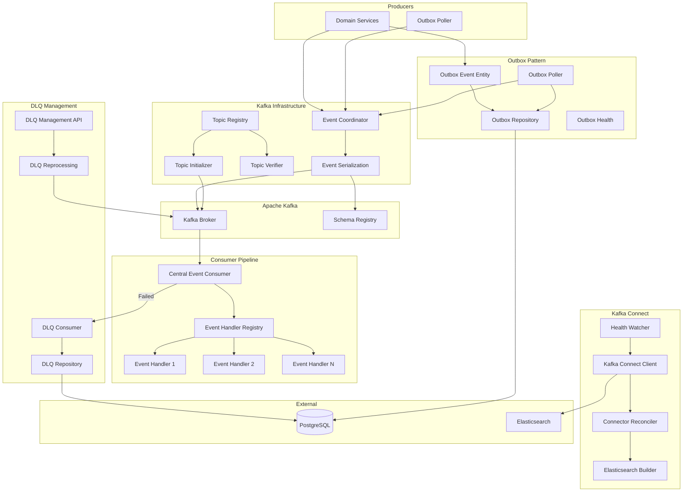

# Spring Kafka Infrastructure

Enterprise-grade Apache Kafka infrastructure library for Spring Boot applications. Provides a centralized topic registry, automated Kafka Connect management, Dead Letter Queue (DLQ) handling, Transactional Outbox pattern, and Avro-based event serialization with Confluent Schema Registry.

## Architecture



## Technology Stack

| Technology | Purpose |
|---|---|
| Java 17 | Runtime |
| Spring Boot 3.3 | Application framework |
| Apache Kafka | Event streaming platform |
| Confluent Schema Registry | Schema management and evolution |
| Apache Avro | Event serialization format |
| Spring WebFlux | Non-blocking Kafka Connect REST client |
| PostgreSQL | Outbox and DLQ persistence |
| Resilience4j | Circuit breaker for Kafka Connect operations |
| Micrometer / Prometheus | Metrics and monitoring |
| Lombok | Boilerplate reduction |

## Key Features

### Topic Registry & Management
- **Declarative Topic Configuration** - Define topics in `application.yml` with naming conventions, partitions, replication factor, and retention policies
- **Automatic Topic Initialization** - Topics are created on application startup with verified configuration
- **Topic Name Resolution** - Consistent topic naming via `TopicNameResolver` and `TopicNamingConverter`
- **Category-Based Organization** - Topics categorized as EVENT, STREAM, ALERT, ANOMALY, METRIC

### Event Processing Pipeline
- **Central Event Consumer** - Single consumer that routes events to registered handlers via `EventHandlerRegistry`
- **Event Serialization** - Avro-based serialization with `EventSerializationService` and `EventTypeRegistry`
- **Event Converter Framework** - Pluggable converters (`AbstractEventConverter`, `EventConverterFactory`) for transforming events between formats

### Dead Letter Queue (DLQ)
- **Automatic DLQ Routing** - Failed events are automatically sent to DLQ topics
- **DLQ Persistence** - Failed events stored in PostgreSQL with error details
- **Reprocessing Service** - Retry failed events with configurable strategies
- **Management API** - REST endpoints for DLQ monitoring and manual reprocessing
- **Health Monitoring** - `DLQHealthStatus` for operational visibility

### Transactional Outbox Pattern
- **Outbox Event Entity** - JPA entity for reliable event publishing
- **Outbox Poller** - Scheduled polling of outbox table for unpublished events
- **Guaranteed Delivery** - Events are persisted in the same transaction as business data
- **Health Monitoring** - `OutboxHealthStatus` for lag and throughput tracking

### Kafka Connect Automation
- **WebClient-Based REST Client** - Non-blocking communication with Kafka Connect API
- **Connector Reconciliation** - Automatically creates/updates connectors to match desired state
- **Elasticsearch Connector Builder** - Pre-configured builder for Elasticsearch sink connectors
- **Health Watcher** - Monitors Kafka Connect cluster health with startup delay support
- **Auto-Bind by Category** - Automatically creates connectors for topics matching specified categories

## Project Structure

```
src/main/java/com/selftech/kafka/
├── KafkaInfrastructureApplication.java
├── config/                                 # Kafka configuration
│   ├── KafkaConfig.java                    # Base Kafka configuration
│   ├── KafkaConsumerConfig.java            # Consumer factory and settings
│   ├── KafkaProducerConfig.java            # Producer factory and settings
│   ├── KafkaStreamsConfig.java             # Streams configuration
│   ├── KafkaTopicInitializer.java          # Auto-creates topics on startup
│   ├── KafkaTopicRegistry.java             # Central topic registry
│   ├── KafkaTopicVerifier.java             # Validates topic configurations
│   ├── TopicCategory.java                  # Topic category enum
│   ├── TopicConfig.java                    # Topic configuration properties
│   ├── TopicDefinition.java                # Topic definition model
│   ├── TopicKey.java                       # Topic identifier
│   ├── TopicNameResolver.java              # Resolves topic names from keys
│   └── TopicNamingConverter.java           # Naming convention converter
├── connect/                                # Kafka Connect automation
│   ├── builder/
│   │   └── ElasticsearchConnectorSpecBuilder.java
│   ├── client/KafkaConnectClient.java      # WebClient REST client
│   ├── config/
│   │   ├── ElasticsearchConnectorProperties.java
│   │   ├── KafkaConnectProperties.java
│   │   └── WebClientConfig.java
│   ├── model/
│   │   ├── ConnectorDefinition.java
│   │   ├── ConnectorSpec.java
│   │   ├── ConnectorStatus.java
│   │   └── ReconciliationResult.java
│   └── reconciler/
│       ├── ConnectorReconciler.java        # Desired state reconciliation
│       └── KafkaConnectHealthWatcher.java
├── converter/                              # Event format conversion
│   ├── AbstractEventConverter.java
│   ├── EventConversionException.java
│   ├── EventConverter.java
│   ├── EventConverterFactory.java
│   └── converters/
│       ├── LockBoxEventConverter.java
│       └── SensorDataEventConverter.java
├── core/                                   # Core event processing
│   ├── config/EventHandlerConfiguration.java
│   ├── consumer/CentralEventConsumer.java
│   ├── dlq/                                # Dead Letter Queue
│   │   ├── DLQConsumer.java
│   │   ├── DLQEvent.java
│   │   ├── DLQEventRepository.java
│   │   ├── DLQEventService.java
│   │   ├── DLQHealthStatus.java
│   │   ├── DLQManagementController.java
│   │   └── DLQReprocessingService.java
│   ├── event/Event.java
│   ├── handler/
│   │   ├── EventHandler.java
│   │   └── EventHandlerRegistry.java
│   ├── outbox/                             # Transactional Outbox
│   │   ├── OutboxEvent.java
│   │   ├── OutboxEventRepository.java
│   │   ├── OutboxEventService.java
│   │   ├── OutboxHealthStatus.java
│   │   └── OutboxPoller.java
│   ├── publisher/CentralEventCoordinator.java
│   └── serialization/
│       ├── EventSerializationService.java
│       └── EventTypeRegistry.java
└── event/publisher/
    └── IEventPublisherService.java         # Publisher interface
```

## Prerequisites

- Java 17+
- Apache Kafka 3.6+
- Confluent Schema Registry
- PostgreSQL 14+
- Kafka Connect (optional, for connector automation)
- Elasticsearch (optional, for sink connectors)
- Maven 3.8+

## Getting Started

1. **Clone the repository**
   ```bash
   git clone https://github.com/erhanbarisolmez/spring-kafka-infrastructure.git
   cd spring-kafka-infrastructure
   ```

2. **Configure environment variables**
   ```bash
   export KAFKA_BOOTSTRAP_SERVERS=localhost:9092
   export KAFKA_SCHEMA_REGISTRY_URL=http://localhost:8081
   export SPRING_DATASOURCE_URL=jdbc:postgresql://localhost:5432/kafka_infrastructure
   export SPRING_DATASOURCE_USERNAME=postgres
   export SPRING_DATASOURCE_PASSWORD=postgres
   ```

3. **Build the project**
   ```bash
   mvn clean install
   ```

4. **Run the application**
   ```bash
   mvn spring-boot:run
   ```

## Configuration

Topics are defined declaratively in `application.yml`:

```yaml
app:
  kafka:
    default-partitions: 3
    default-replication-factor: 1
    topics:
      my-domain-events:
        name: my-domain.event.v0
        category: EVENT
        retention-days: 30
```

Kafka Connect automation is configured under `app.kafka.connect`:

```yaml
app:
  kafka:
    connect:
      url: http://kafka-connect:8083
      elasticsearch:
        enabled: true
        auto-bind:
          categories:
            ANOMALY: elasticsearch
            ALERT: elasticsearch
```
